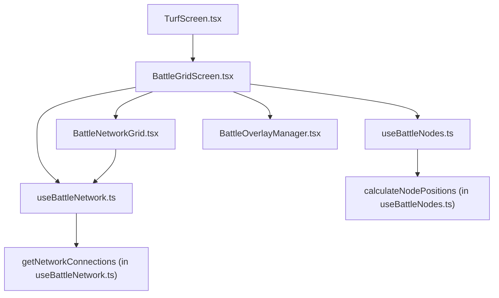

# Battle Grid File Connections Map

_This file tracks the direct file connections for the current BattleGridScreen.tsx workflow. Use this to quickly see which files are actively involved and how they relate._

## Diagram: File Connection Flow

## Connection Notes

- **[TurfScreen.tsx](./src/screens/TurfScreen.tsx) → [BattleGridScreen.tsx](./src/screens/BattleGridScreen.tsx)**: TurfScreen renders BattleGridScreen as the main entry point for the battle grid UI.
- **[BattleGridScreen.tsx](./src/screens/BattleGridScreen.tsx) → [useBattleNodes.ts](./src/hooks/useBattleNodes.ts)**: Uses `useInitialBattleNodes` to get node positions for the grid.
- **[BattleGridScreen.tsx](./src/screens/BattleGridScreen.tsx) → [useBattleNetwork.ts](./src/hooks/useBattleNetwork.ts)**: Uses `useBattleNetworkConnections` to get network connection data.
- **[BattleGridScreen.tsx](./src/screens/BattleGridScreen.tsx) → [BattleNetworkGrid.tsx](./src/components/battle/BattleNetworkGrid.tsx)**: Renders the network grid visualization.
- **[BattleGridScreen.tsx](./src/screens/BattleGridScreen.tsx) → [BattleOverlayManager.tsx](./src/components/battle/BattleOverlayManager.tsx)**: Renders overlays (UI elements above the grid).
- **[useBattleNodes.ts](./src/hooks/useBattleNodes.ts) → calculateNodePositions**: The hook calls this function to compute node positions.
- **[useBattleNetwork.ts](./src/hooks/useBattleNetwork.ts) → getNetworkConnections**: The hook calls this function to compute network connections.
- **[BattleNetworkGrid.tsx](./src/components/battle/BattleNetworkGrid.tsx) → [useBattleNetwork.ts](./src/hooks/useBattleNetwork.ts)**: Imports types and helpers for rendering connections.

---

_This file is intended to be used alongside [current-task.md](./current-task.md) to keep track of the active files and their relationships in the battle grid workflow._ 