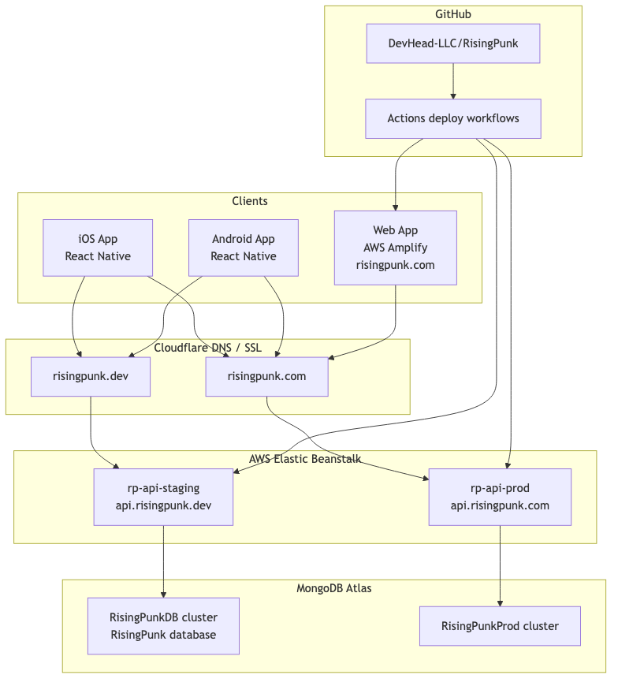
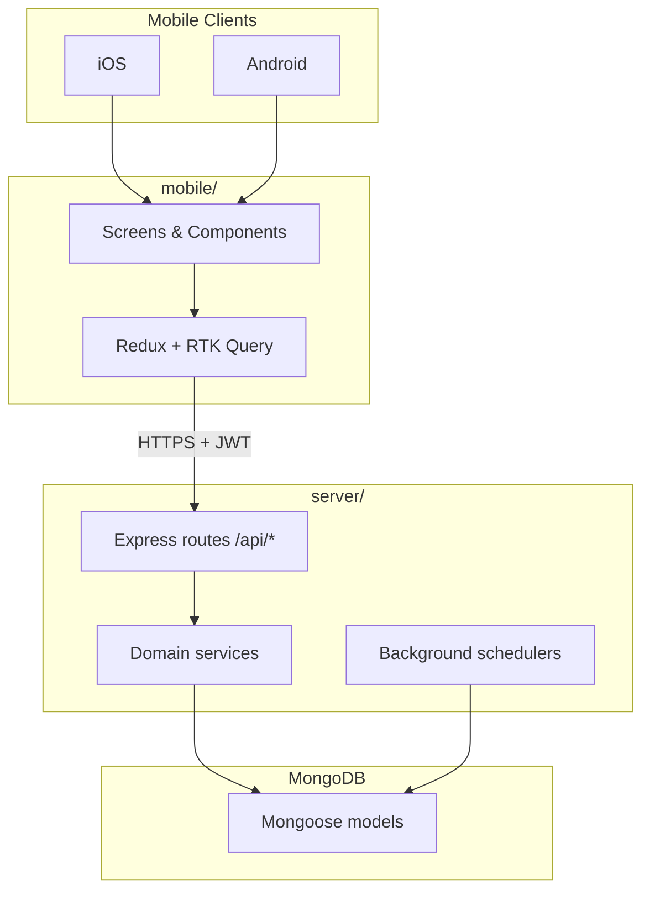

# System Overview

RisingPunk is a monorepo with three main code areas:

| Path | Role |
|------|------|
| `mobile/` | React Native app for iOS and Android |
| `server/` | Express + TypeScript REST API |
| `shared/` | Shared TypeScript contracts used by mobile and server |

## Infrastructure (while live)

See the infrastructure diagram:

**Traffic flow (simplified):**

1. Mobile apps and the web app called API hosts behind Cloudflare (`api.risingpunk.com`, `api.risingpunk.dev`).
2. The marketing site was served from AWS Amplify at `risingpunk.com`.
3. The API ran on AWS Elastic Beanstalk (`rp-api-prod`, `rp-api-staging`).
4. Data was stored in MongoDB Atlas (`RisingPunkDB` / `RisingPunkProd` clusters).

## Application architecture

## Major game domains (server-backed)

| Domain | API prefix | Summary |
|--------|------------|---------|
| Auth & users | `/api/auth`, `/api/users` | Guest, Apple/Google sign-in, JWT sessions, profile |
| Turf / economy | `/api/users`, research, rental housing | Base building, income, research, bots |
| Hack map | `/api/map`, `/api/attack`, `/api/probe` | World grid, async marches, PvP/NPC battles |
| Crews & social | `/api/crew`, `/api/private-messages` | Crews, chat, DMs, battle reports |
| Bug hunt | `/api/bug-hunt` | Ant world, hunters, storage, tokens |
| Swarms | `/api/swarm` | Group hack sessions |
| Transfers | `/api/transfer-runs` | Player-to-player item/cash transfers |
| IAP | `/api/iap` | Store verify + developer-support ledger |
| Mini-games | `/api/daily-haul`, `/api/packet-breach`, etc. | Standalone game modes |

## Design principles

1. **Server authority** — Economy, combat, march timing, and IAP grants are validated on the server.
2. **Shared contracts** — IAP catalog, battle replay format, and map copy live in `shared/`.
3. **Async-first map play** — Marches, swarms, and bug hunts resolve via scheduled server sweeps (multi-instance safe on Elastic Beanstalk).
4. **Fail-fast config** — Missing env vars throw at startup rather than silently defaulting.

## Deeper dive

For a longer application-focused write-up (more Mermaid, API tables, sequences), see [`architectural_diagram.md`](../reference/architectural_diagram.md).

## Deployment detail

- [environments.md](environments.md)
- [../deployment/](../deployment/)
