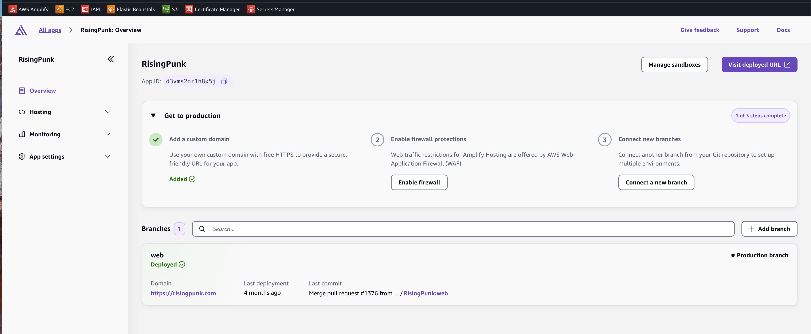

# AWS Amplify

The **marketing / landing web app** for RisingPunk was hosted on **AWS Amplify**.

## App details (while live)

| Setting | Value |
|---------|--------|
| Amplify app | RisingPunk |
| Production branch | `web` |
| Custom domain | `https://risingpunk.com` |
| Deploy trigger | Git branch connection (merge to `web`) |

## What it hosted

- Product landing page (hero, feature highlights, store links)
- Embedded promo video (“See It In Action”)
- “Why RisingPunk?” feature grid
- Links to App Store and Google Play

The **game API** was not on Amplify — it ran on Elastic Beanstalk. The mobile apps talked directly to `api.risingpunk.com` / `api.risingpunk.dev`.

## Screenshot (archive)

## Decommission notes

1. Disconnect or delete the Amplify app in AWS Console.
2. Remove the `risingpunk.com` custom domain mapping in Amplify.
3. Update Cloudflare DNS if the apex record pointed at Amplify.
4. Archive or delete the `web` branch in GitHub if it existed only for the site.

See [../decommission/decommission-checklist.md](../decommission/decommission-checklist.md).
