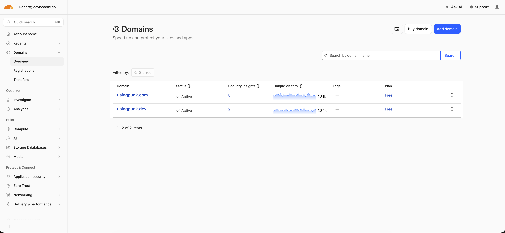
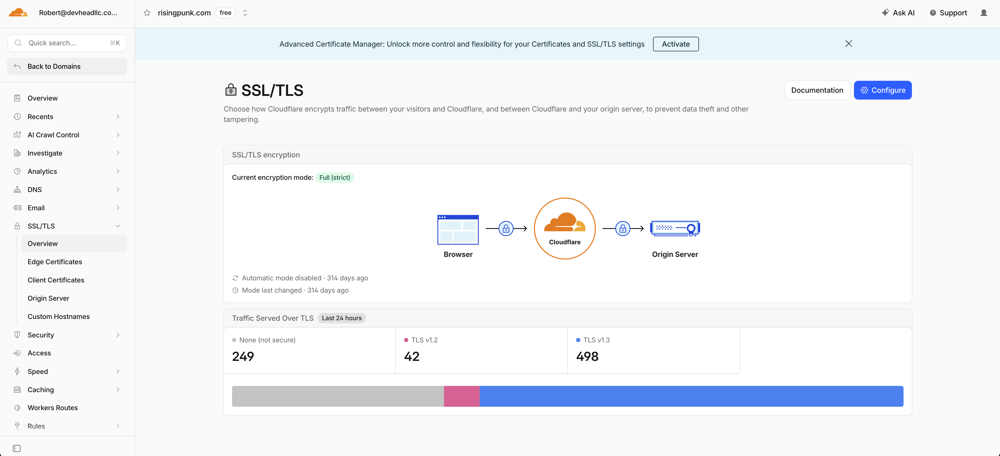

# Cloudflare DNS & SSL

DNS and TLS for RisingPunk domains were managed in **Cloudflare**.

## Domains (while live)

| Domain | Status | Role |
|--------|--------|------|
| `risingpunk.com` | Active | Web (Amplify), marketing |
| `risingpunk.dev` | Active | Staging-related services |

Both were on Cloudflare’s **Free** plan at time of archive screenshots.

## SSL/TLS

`risingpunk.com` used **Full (strict)** encryption:

- Browser → Cloudflare (TLS)
- Cloudflare → origin (valid certificate required on EB / Amplify)

## API routing

Mobile and web clients reached the API at:

- `api.risingpunk.com` → production Elastic Beanstalk
- `api.risingpunk.dev` → staging Elastic Beanstalk

Exact DNS record types (CNAME vs proxied orange-cloud) are in Cloudflare; screenshots below show domain and SSL overview only.

## Screenshots (archive)

| Image | Description |
|-------|-------------|
|  | Domain list (`risingpunk.com`, `risingpunk.dev`) |
|  | Full (strict) mode and traffic-over-TLS chart |

## Decommission notes

1. Remove or update DNS records pointing to decommissioned EB / Amplify origins.
2. Optionally transfer or let domains expire per your registrar plan.
3. Download any DNS export for records if you want an offline copy.

See [../decommission/decommission-checklist.md](../decommission/decommission-checklist.md).
