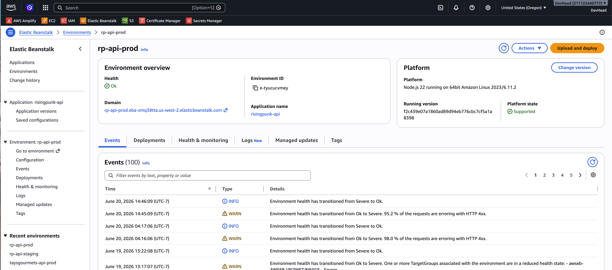
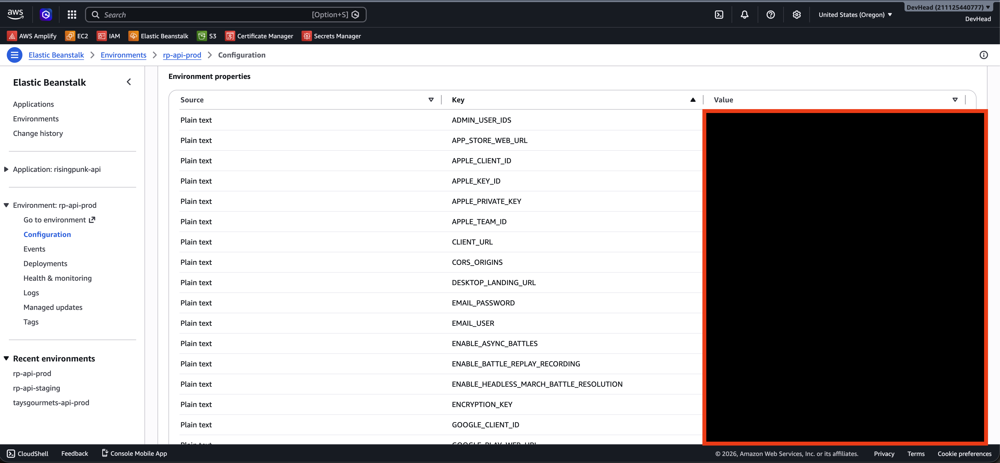

# Elastic Beanstalk

The RisingPunk API was deployed to **AWS Elastic Beanstalk** in `us-west-2` (Oregon).

## Application

| Setting | Value |
|---------|--------|
| EB application | `risingpunk-api` |
| Production environment | `rp-api-prod` |
| Staging environment | `rp-api-staging` |
| Platform | Node.js 22 on Amazon Linux 2023 |
| Process | `web: node dist/server/server.js` |

## Public URLs

| Environment | URL |
|-------------|-----|
| Production | `https://api.risingpunk.com` (via Cloudflare) |
| Staging | `https://api.risingpunk.dev` (via Cloudflare) |

Raw EB hostnames followed the pattern `rp-api-prod.eba-*.us-west-2.elasticbeanstalk.com`.

## Deployment

GitHub Actions workflows build TypeScript (`npm run build` in `server/`), zip `dist/` + `package.json` + `Procfile`, upload to S3, and call `elasticbeanstalk update-environment`:

- **Staging:** push to `staging` branch (paths `server/**`)
- **Production:** push to `prod` branch (paths `server/**`)

See `.github/workflows/deploy-staging.yml` and `deploy-production.yml`.

## Configuration

Environment variables were set in the EB console (dozens of keys: auth, CORS, MongoDB URI, Apple/Google credentials, feature flags, email, encryption, etc.). **Secrets are not stored in this repo.**

## Screenshots (archive)

| Image | Description |
|-------|-------------|
|  | `rp-api-prod` environment overview and health events |
|  | Environment variable keys (values redacted) |

## Decommission notes

When tearing down:

1. Terminate EB environments (`rp-api-prod`, `rp-api-staging`).
2. Delete or retain the `risingpunk-api` application as desired.
3. Remove unused application versions and S3 deployment artifacts in the EB bucket.
4. Revoke IAM keys used only for EB deploy if no longer needed.

See [../decommission/decommission-checklist.md](../decommission/decommission-checklist.md).
