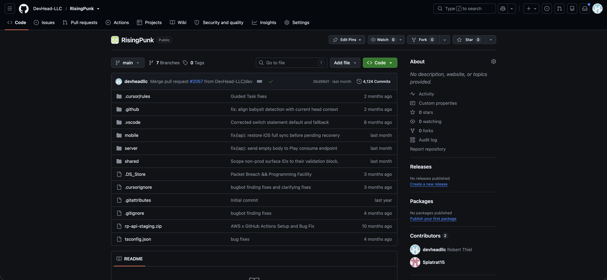
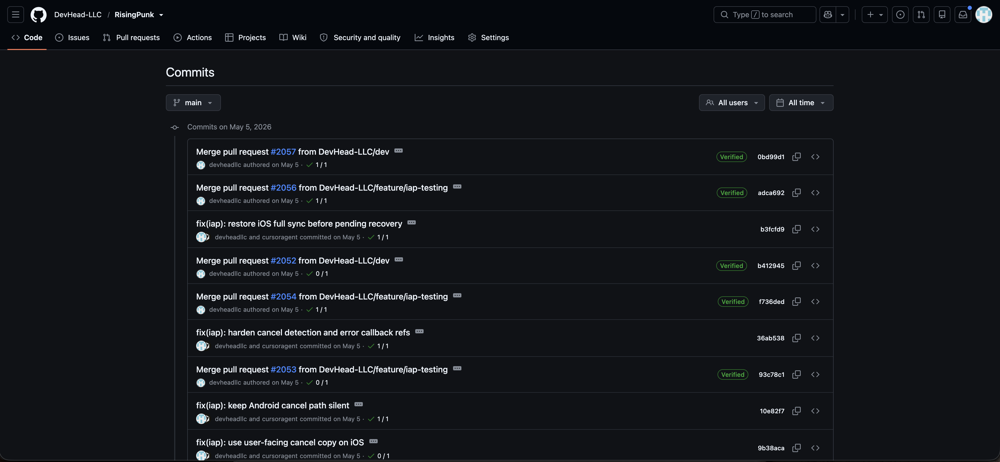

# GitHub & CI/CD

Source and deployment automation lived in **GitHub** (`DevHead-LLC/RisingPunk`).

## Repository layout

| Path | Purpose |
|------|---------|
| `mobile/` | React Native app |
| `server/` | Express API |
| `shared/` | Shared TypeScript |
| `.github/workflows/` | Deploy and promotion automation |

## Deploy workflows

| Workflow | Trigger | Target |
|----------|---------|--------|
| `deploy-staging.yml` | Push to `staging` (`server/**`) | Elastic Beanstalk staging |
| `deploy-production.yml` | Push to `prod` (`server/**`) | Elastic Beanstalk production |
| `auto-promote-branches.yml` | Cursor Bugbot check success | Branch promotion PRs |
| `babysit-manual.yml` | Manual / automated comment | Bugbot fix loop |

Deploy secrets (AWS credentials, EB app/env names, S3 bucket) were stored as **GitHub repository secrets**, not in the repo.

## Branch flow (typical)

`feature/*` → `dev` → `main` → `staging` → `prod`

Web marketing site used a separate **`web`** branch connected to AWS Amplify.

## Screenshots (archive)

| Image | Description |
|-------|-------------|
|  | Repository file tree |
|  | Commit history on `main` |

## After decommission

- Remove or disable deploy workflows if you want zero deploy surface.
- Delete `AWS_*` and `EB_*` secrets from repository settings.
- Keep workflows in git as documentation of how deploys worked.

See [../decommission/decommission-checklist.md](../decommission/decommission-checklist.md).
