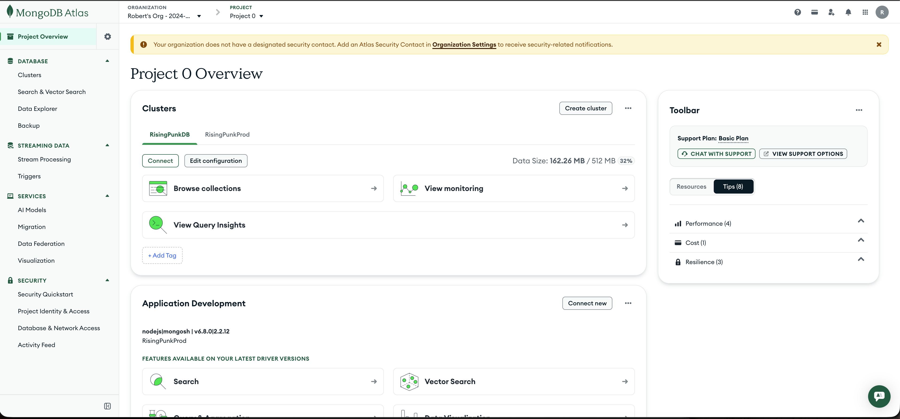
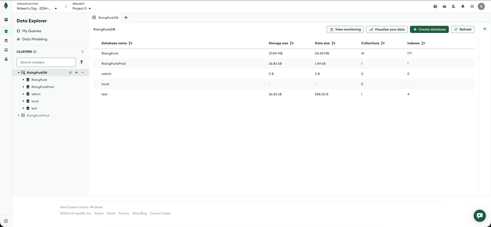

# MongoDB Atlas

RisingPunk used **MongoDB Atlas** for all persistent game data.

## Clusters (while live)

| Cluster | Typical use |
|---------|-------------|
| `RisingPunkDB` | Development / staging data (`RisingPunk` database) |
| `RisingPunkProd` | Production data |

The server selects the database name at runtime:

- `NODE_ENV=production` → `RisingPunkProd`
- Otherwise → `RisingPunk`

Connection string was provided via `MONGODB_URI` in Elastic Beanstalk environment properties (not in repo).

## Scale (archive snapshot)

The `RisingPunk` database on the `RisingPunkDB` cluster had on the order of **40+ collections** and **170+ indexes** — consistent with a full game backend (users, map cells, battles, marches, crews, messages, bug hunt, etc.).

## Screenshots (archive)

| Image | Description |
|-------|-------------|
|  | Atlas project with `RisingPunkDB` and `RisingPunkProd` clusters |
|  | Database list and collection/index counts |

## Decommission notes

1. Export a final backup if you want a personal archive (optional).
2. Delete database users and IP access rules tied to EB.
3. Pause or terminate Atlas clusters to stop billing.
4. Remove `MONGODB_URI` from any remaining secret stores.

See [../decommission/decommission-checklist.md](../decommission/decommission-checklist.md).
