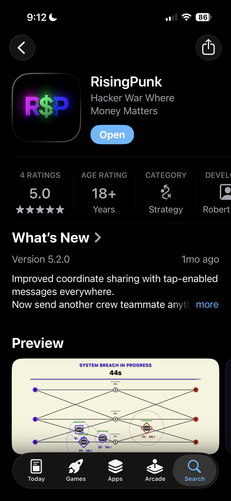
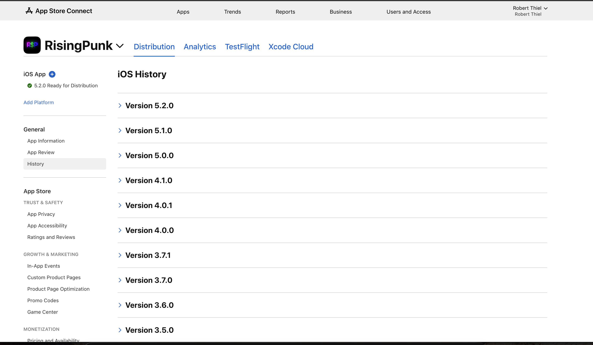
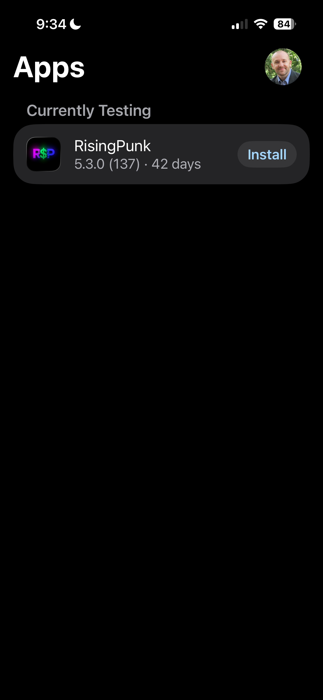
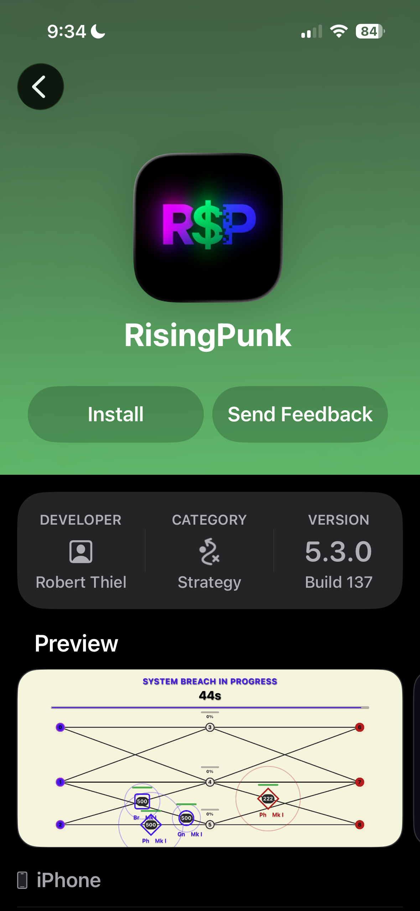
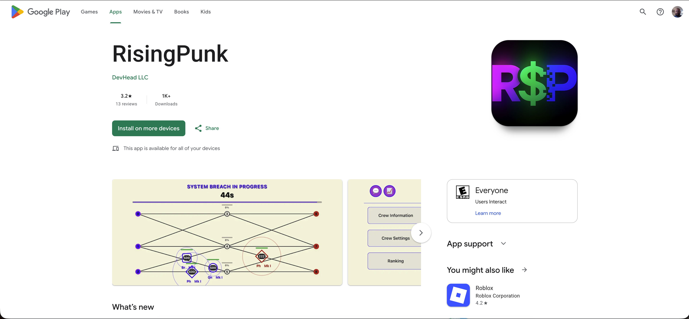
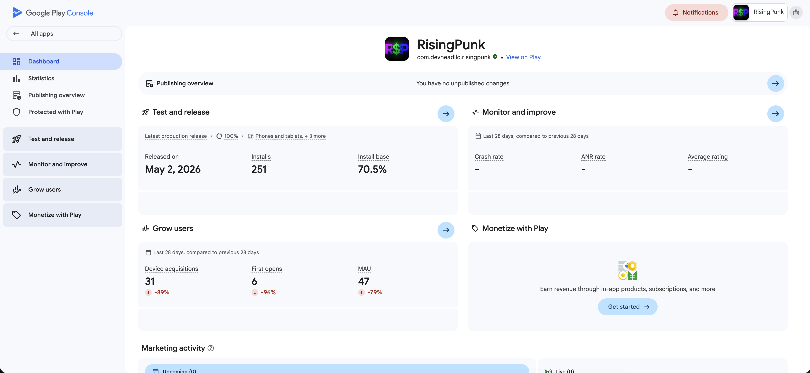

# App Store & Play Store

RisingPunk shipped on both major mobile stores under **DevHead LLC**.

## iOS (App Store)

| Field | Value (archive) |
|-------|-----------------|
| App name | RisingPunk |
| Subtitle | Hacker War Where Money Matters |
| Category | Strategy |
| Bundle / team | DevHead LLC (Robert Thiel) |
| Version history | 3.5.0 → 5.2.0+ (see App Store Connect screenshot) |
| TestFlight | 5.3.0 (build 137) |

### Screenshots

| | |
|---|---|
|  | Public App Store listing |
|  | App Store Connect version history |
|  | TestFlight |
|  | TestFlight detail |

### Integrations

- Apple Sign-In
- In-App Purchases (consumable developer-support tiers)
- App Store Server Notifications webhook (`/api/iap/webhooks/apple`)
- Game Center (iOS)

## Android (Google Play)

| Field | Value (archive) |
|-------|-----------------|
| Package | `com.devheadllc.risingpunk` |
| Developer | DevHead LLC |
| Latest production release (snapshot) | May 2, 2026 |
| Installs (snapshot) | ~251 |

### Screenshots

| | |
|---|---|
|  | Google Play store listing |
|  | Play Console metrics |

### Integrations

- Google Sign-In
- Google Play Billing + server verify
- `BILLING` permission in `AndroidManifest.xml`

## Store decommission

When removing the app from stores:

1. Unpublish or remove listings per Apple/Google policy (or leave listing with “not available” if required).
2. Revoke API keys for App Store Connect / Play Console service accounts if dedicated.
3. Disable IAP webhooks pointing at decommissioned API hosts.
4. Archive store assets (screenshots, descriptions) — many are captured in [`screenshots.md`](screenshots.md).

See [../decommission/decommission-checklist.md](../decommission/decommission-checklist.md).
