# Screenshots

Archive screenshots from the live product. Paths are relative to this file.

## Branding

| | |
|---|---|
|  | App icon / logo |
|  | Logo (background removed) |

## Web (AWS Amplify)

| | |
|---|---|
| 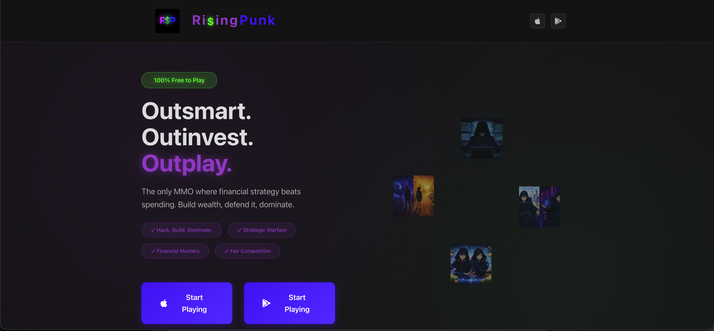 | Landing page hero |
| 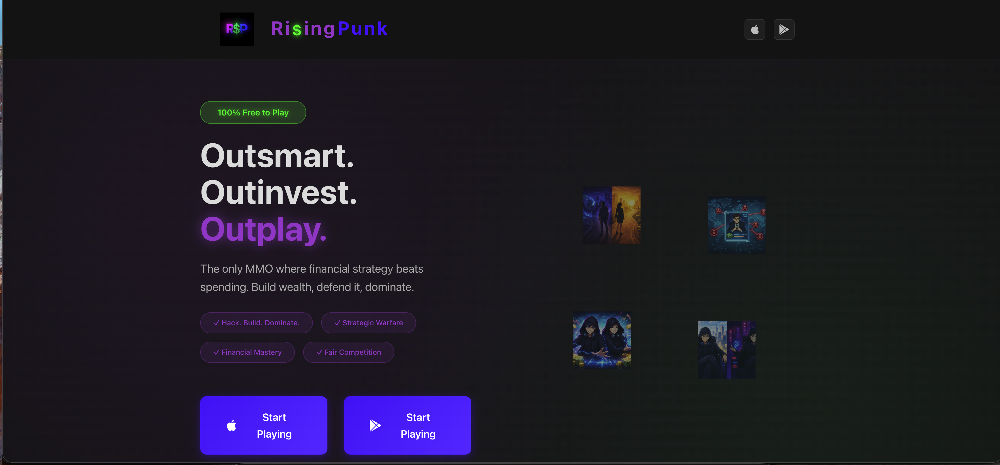 | Landing page (alternate crop) |
| 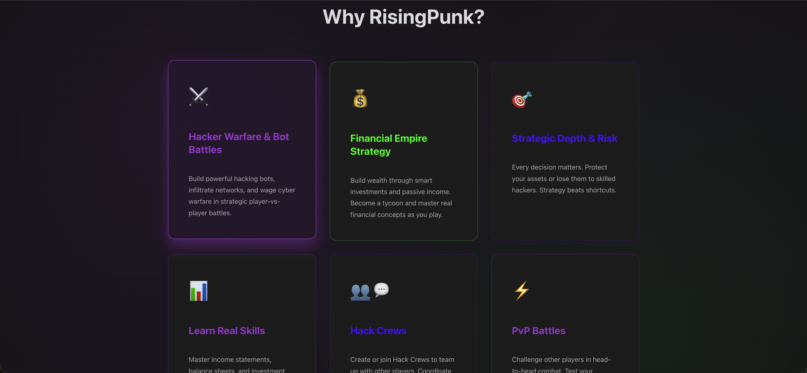 | Feature grid |
| 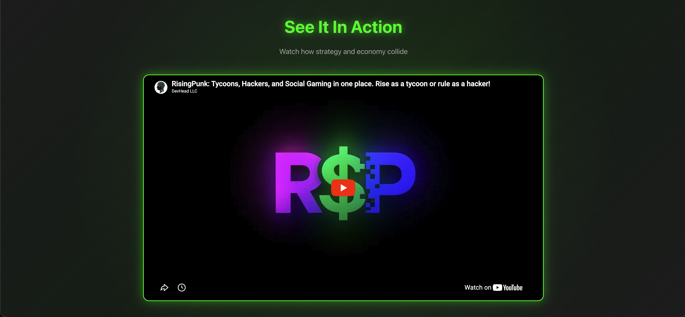 | Embedded YouTube promo |

## Mobile — Turf & facilities

| | |
|---|---|
| 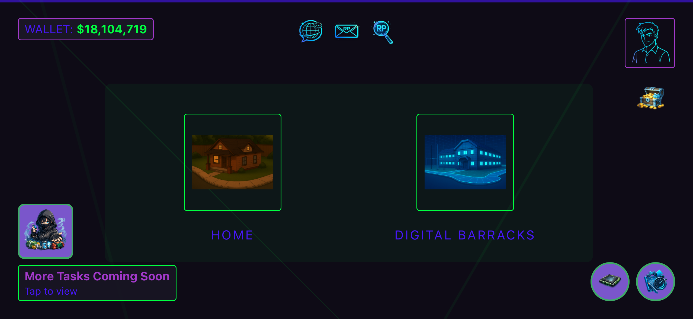 | Turf hub (Home, Digital Barracks, wallet) |
| 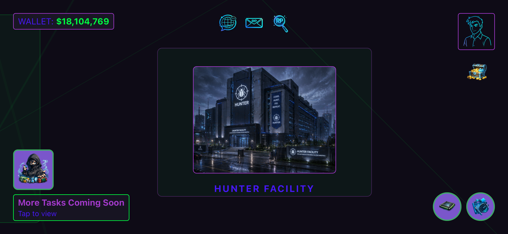 | Hunter Facility |
| 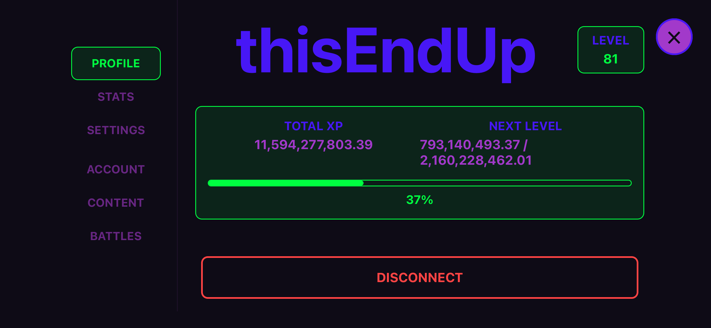 | Profile / XP |
| 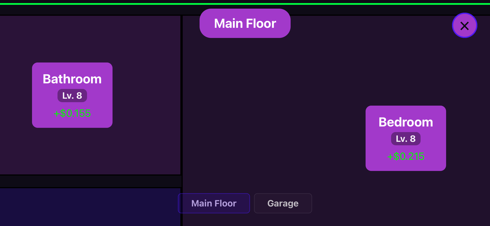 | Home room upgrades |
| 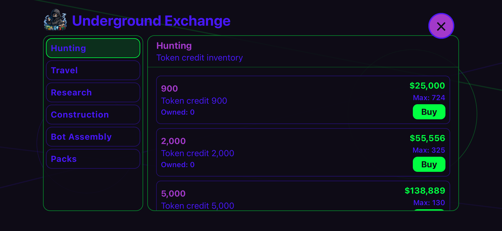 | Underground Exchange shop |

## Mobile — Hack map & battles

| | |
|---|---|
| 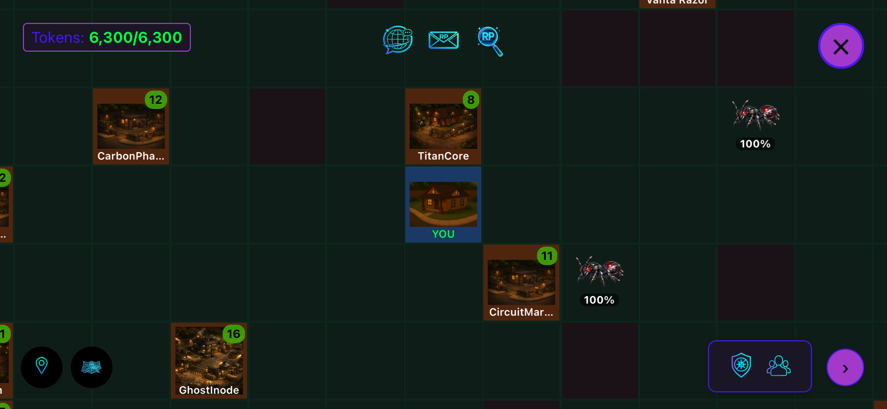 | World map with ants and tokens |
| 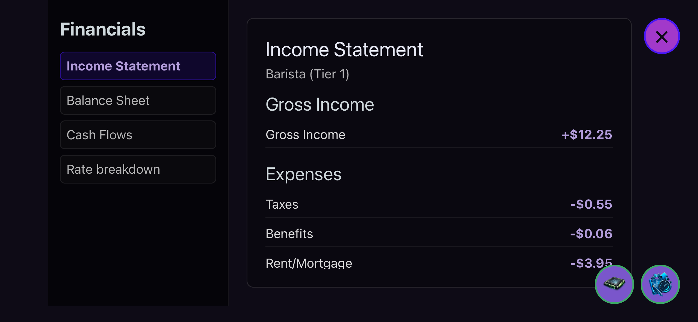 | Battle preparation |
| 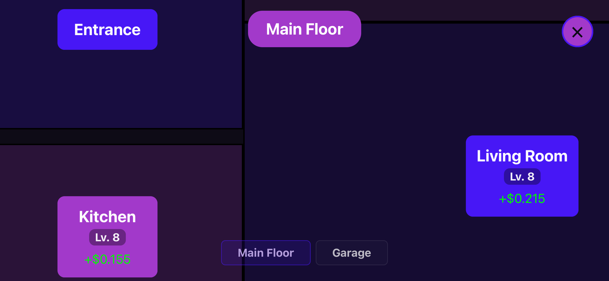 | Crew-related screen |
| 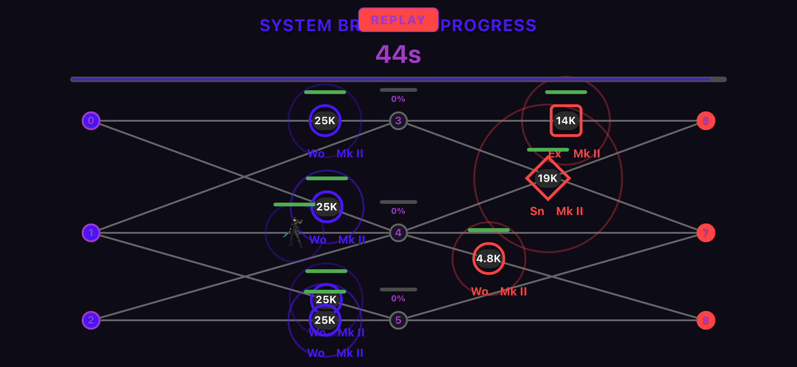 | Gameplay screen |
| 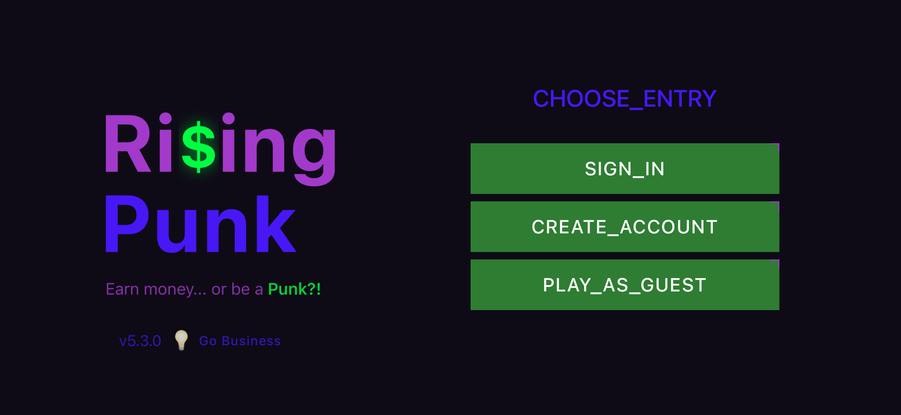 | Gameplay screen |
| 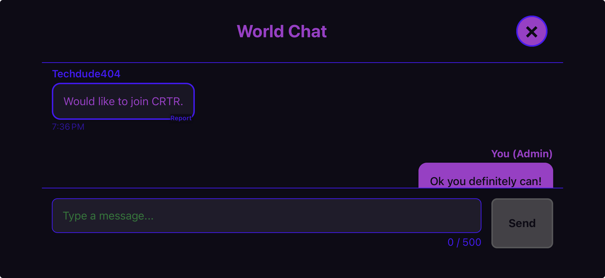 | World chat modal |

## Store listings & TestFlight

See also [app-store-play-store.md](app-store-play-store.md).

| | |
|---|---|
|  | App Store product page |
|  | TestFlight build 5.3.0 |
|  | TestFlight install screen |

## Additional mobile captures

| | |
|---|---|
| 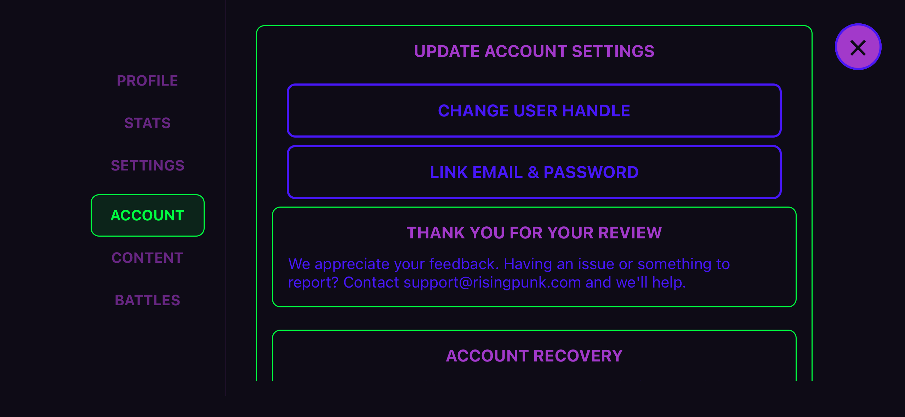 | Mobile UI |
|  | Mobile UI |

## Infrastructure & repo (deployment folder)

For AWS, Cloudflare, Atlas, GitHub, and store-console screenshots, see the deployment docs:

- [elastic-beanstalk.md](../deployment/elastic-beanstalk.md)
- [aws-amplify.md](../deployment/aws-amplify.md)
- [mongodb-atlas.md](../deployment/mongodb-atlas.md)
- [cloudflare-dns.md](../deployment/cloudflare-dns.md)

Raw files: [`../deployment/images/`](../deployment/images/)
