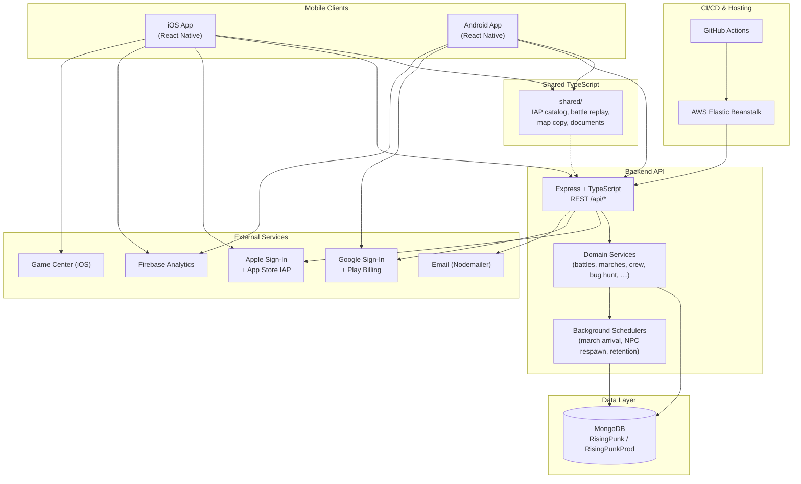
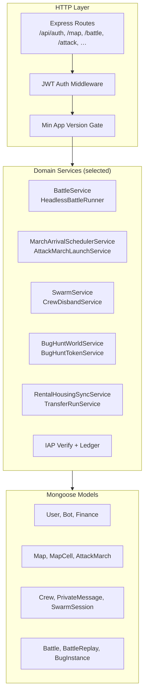
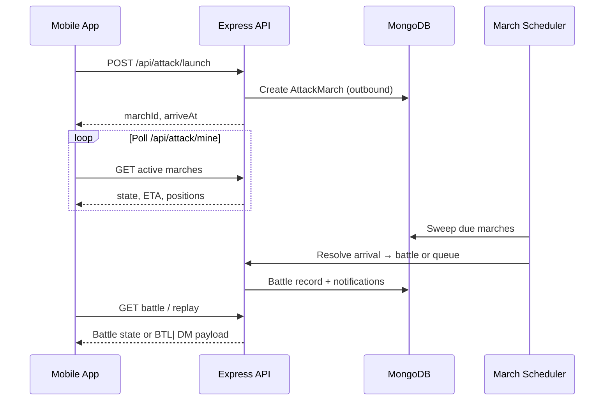
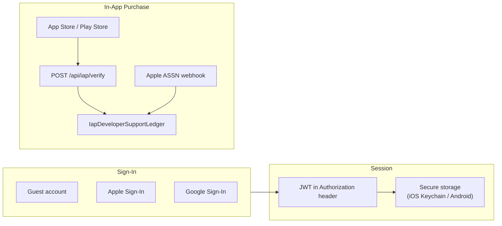
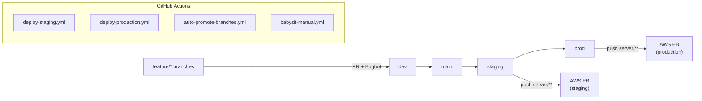

# RisingPunk — System Architecture

**RisingPunk** is a cross-platform mobile strategy game (iOS & Android) built with React Native. Players manage a hacker-themed empire: turf/base building, world-map PvP/NPC combat, crew coordination, bug hunts, mini-games, and in-app purchases. The backend is a Node.js/Express API backed by MongoDB, deployed to AWS Elastic Beanstalk.

---

## High-Level Overview

---

## Repository Structure

| Path | Role |
|------|------|
| `mobile/` | React Native app (iOS + Android), Redux Toolkit, RTK Query |
| `server/` | Express API, Mongoose models, domain services, schedulers |
| `shared/` | Cross-platform TypeScript contracts (IAP, battle replay, map copy) |
| `.github/workflows/` | Deploy (staging/prod), branch promotion, Bugbot babysit loop |

---

## Mobile Client Architecture

```mermaid
flowchart LR
    subgraph UI["Screens & Components"]
        Turf["Turf / Base"]
        HackMap["Hack Map"]
        Battle["Battle Grid"]
        Crew["Crew & Chat"]
        MiniGames["Mini-Games\n(Daily Haul, Packet Breach, …)"]
    end

    subgraph State["State Management"]
        Redux["Redux Slices\nauth, balance, bots, map, ui"]
        RTK["RTK Query APIs\n20+ endpoint modules"]
    end

    subgraph Native["Native Integrations"]
        IAP["react-native-iap"]
        Keychain["react-native-keychain"]
        AppleAuth["Apple Sign-In"]
        GoogleAuth["Google Sign-In"]
    end

    UI --> Redux
    UI --> RTK
    RTK -->|"HTTPS + JWT"| API["Backend API"]
    Native --> UI
    Redux --> RTK
```

**Key patterns**

- **Environment-aware API URL** via `react-native-config` (`dev` / `staging` / `prod`)
- **RTK Query** for server state with tag-based cache invalidation
- **Redux slices** for session, wallet, bot inventory, and map UI state
- **Screen handoff globals** for Turf ↔ Hack Map navigation (battle prep, swarm, bug hunt)
- **Polling** for async game systems (attack marches, transfer runs, swarm sessions)

---

## Backend Architecture

**API surface (representative)**

| Prefix | Domain |
|--------|--------|
| `/api/auth` | Login, guest, Apple/Google OAuth, JWT sessions |
| `/api/map` | World grid, occupancy, probes, shields |
| `/api/attack` | Async marches (solo, swarm, bug hunt) |
| `/api/battle` | Live and headless PvP/NPC battles |
| `/api/crew` | Crew roster, chat, swarm prep |
| `/api/bug-hunt` | Ant world, hunters, storage, tokens |
| `/api/transfer-runs` | Player-to-player item/cash transfers |
| `/api/iap` | Store receipt verify + developer-support ledger |
| `/api/private-messages` | DMs, battle reports (`BTL\|`), system messages |

**Background work**

Server instances run scheduled sweeps (multi-instance safe via MongoDB leases/indexes):

- March arrival and stale-state recovery
- NPC respawn timers
- Crew understaff/disband watchdogs
- Battle data retention and privacy cleanup
- Ant world reseed scheduler

---

## Core Game Flow: Async Map Attack

Battles can run **headlessly** on the server (`HeadlessBattleRunner`) while the player is offline. Results arrive via private messages and battle-report replays (`shared/battleReplay.ts`).

---

## Authentication & Payments

---

## Data & Environments

| Environment | Mobile build | API host | MongoDB database |
|-------------|--------------|----------|------------------|
| Development | `.env.dev` | localhost / emulator | `RisingPunk` |
| Staging | `.env.staging` | `api.risingpunk.dev` | `RisingPunk` |
| Production | `.env.prod` | `api.risingpunk.com` | `RisingPunkProd` |

---

## Deployment Pipeline

Mobile releases are built locally or via store pipelines (Xcode / Gradle AAB) with environment-specific schemes and `ENVFILE` configuration.

---

## Technology Stack

| Layer | Technologies |
|-------|----------------|
| Mobile | React Native 0.83, React 19, TypeScript, Redux Toolkit, RTK Query, Reanimated, Gesture Handler |
| Backend | Node.js, Express, TypeScript, Mongoose, Jest |
| Database | MongoDB |
| Auth | JWT, Apple Sign-In, Google Sign-In, bcrypt |
| IAP | react-native-iap, Apple App Store Server Library, Google Play APIs |
| Analytics | Firebase Analytics |
| Hosting | AWS Elastic Beanstalk (S3 artifact deploy) |
| CI | GitHub Actions, Cursor Bugbot integration |

---

## Design Principles (observable in codebase)

1. **Server authority** — Game economy, combat outcomes, march timing, and IAP grants are validated and persisted on the server.
2. **Shared contracts** — Critical cross-platform logic (IAP catalog, battle replay format) lives in `shared/`.
3. **Async-first map gameplay** — Marches, swarms, bug hunts, and transfer runs use scheduled server resolution rather than requiring an open socket.
4. **Fail-fast configuration** — Missing env vars (API URL, Mongo URI) throw at startup rather than silently defaulting.
5. **Multi-instance safety** — Schedulers use MongoDB indexes, leases, and idempotent settlement for horizontal scaling on Elastic Beanstalk.

---

*Generated from the RisingPunk monorepo structure. Suitable for portfolio and technical onboarding.*
